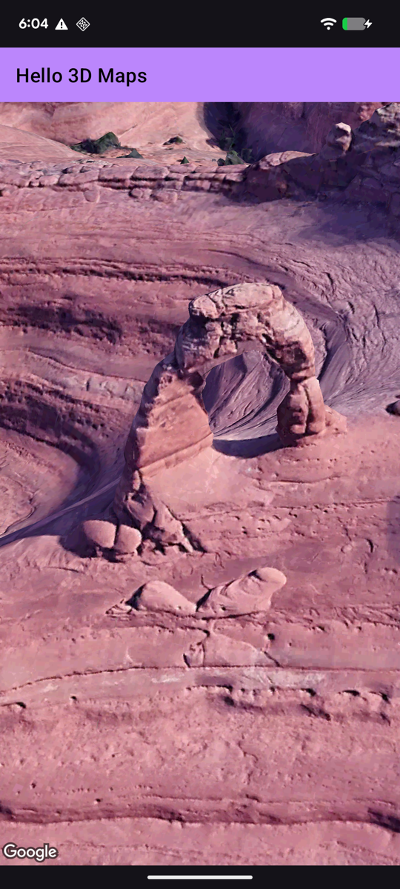
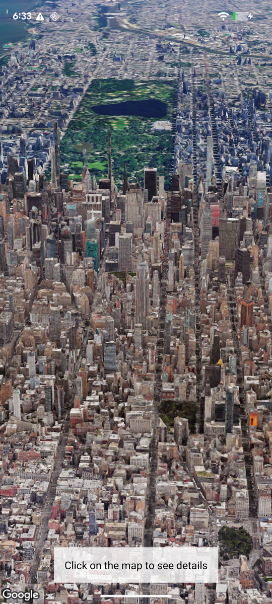
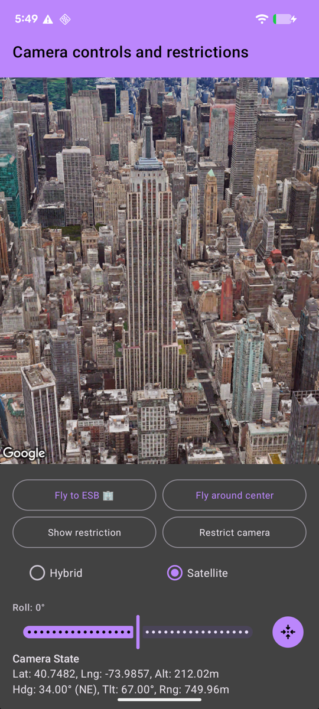
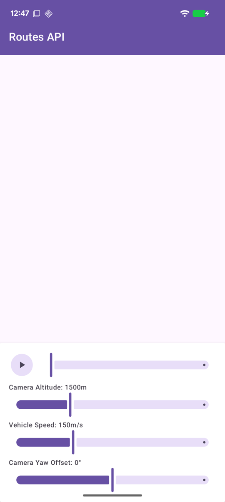

# ☕ Java Samples Catalog

This directory contains the Java samples using traditional Android Views for the Android Maps 3D SDK.

## 📊 Sample Status

| Feature | Status | Source Code | Screenshot |
| :--- | :--- | :--- | :--- |
| **Basic Map** | ✅ Done | [HelloMapActivity.java](src/main/java/com/example/maps3djava/hellomap/HelloMapActivity.java) |  |
| **Polylines** | ✅ Done | [PolylinesActivity.java](src/main/java/com/example/maps3djava/polylines/PolylinesActivity.java) | |
| **Map Interactions** | ✅ Done | [MapInteractionsActivity.java](src/main/java/com/example/maps3djava/mapinteractions/MapInteractionsActivity.java) |  |
| **Popovers** | ✅ Done | [PopoversActivity.java](src/main/java/com/example/maps3djava/popovers/PopoversActivity.java) | |
| **Camera Controls** | ✅ Done | [CameraControlsActivity.java](src/main/java/com/example/maps3djava/cameracontrols/CameraControlsActivity.java) |  |
| **Polygons** | ✅ Done | [PolygonsActivity.java](src/main/java/com/example/maps3djava/polygons/PolygonsActivity.java) | |
| **Models** | ✅ Done | [ModelsActivity.java](src/main/java/com/example/maps3djava/models/ModelsActivity.java) | |
| **Markers** | ✅ Done | [MarkersActivity.java](src/main/java/com/example/maps3djava/markers/MarkersActivity.java) | |
| **Camera Restrictions** | 🚧 Skeleton | [CameraRestrictionsActivity.java](src/main/java/com/example/maps3djava/camerarestrictions/CameraRestrictionsActivity.java) | |
| **Flight Simulator** | 🚧 Skeleton | [FlightSimulatorActivity.java](src/main/java/com/example/maps3djava/flightsimulator/FlightSimulatorActivity.java) | |
| **Routes API** | ✅ Done | [RoutesActivity.java](src/main/java/com/example/maps3djava/routes/RoutesActivity.java) |  |
| **Path Following** | 🚧 Skeleton | [PathFollowingActivity.java](src/main/java/com/example/maps3djava/pathfollowing/PathFollowingActivity.java) | |
| **Path Styling** | 🚧 Skeleton | [PathStylingActivity.java](src/main/java/com/example/maps3djava/pathstyling/PathStylingActivity.java) | |
| **Animating Models** | 🚧 Skeleton | [AnimatingModelsActivity.java](src/main/java/com/example/maps3djava/animatingmodels/AnimatingModelsActivity.java) | |
| **Place Search** | 🚧 Skeleton | [PlaceSearchActivity.java](src/main/java/com/example/maps3djava/placesearch/PlaceSearchActivity.java) | |
| **Place Autocomplete** | 🚧 Skeleton | [PlaceAutocompleteActivity.java](src/main/java/com/example/maps3djava/placeautocomplete/PlaceAutocompleteActivity.java) | |
| **Place Details** | 🚧 Skeleton | [PlaceDetailsActivity.java](src/main/java/com/example/maps3djava/placedetails/PlaceDetailsActivity.java) | |
| **Advanced Camera Animation** | 🚧 Skeleton | [AdvancedCameraAnimationActivity.java](src/main/java/com/example/maps3djava/advancedcameraanimation/AdvancedCameraAnimationActivity.java) | |
| **Data Visualization** | 🚧 Skeleton | [DataVisualizationActivity.java](src/main/java/com/example/maps3djava/datavisualization/DataVisualizationActivity.java) | |
| **Cloud Map Styling** | 🚧 Skeleton | [CloudStylingActivity.java](src/main/java/com/example/maps3djava/cloudstyling/CloudStylingActivity.java) | |
| **Roadmap Mode** | 🚧 Skeleton | [RoadmapModeActivity.java](src/main/java/com/example/maps3djava/roadmapmode/RoadmapModeActivity.java) | |
| **Field Of View** | 🚧 Skeleton | [FieldOfViewActivity.java](src/main/java/com/example/maps3djava/fieldofview/FieldOfViewActivity.java) | |

---
> [!NOTE]
> These samples are view-based and serve as a reference for Java developers.
> Status `🚧 Skeleton` means the activity exists and can be launched from the main list, but contains a TODO placeholder UI.
