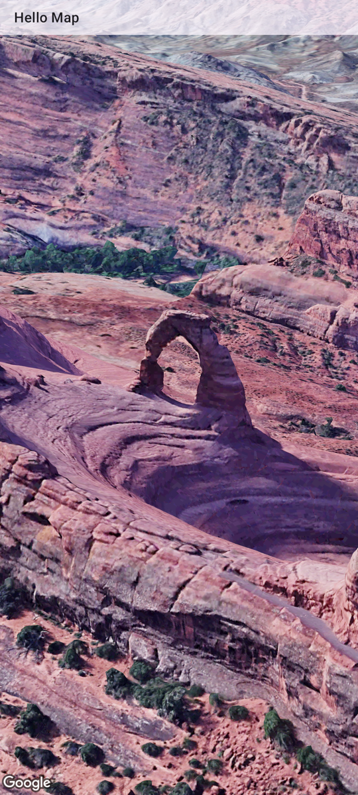
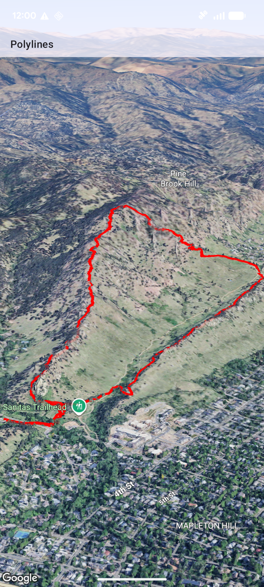
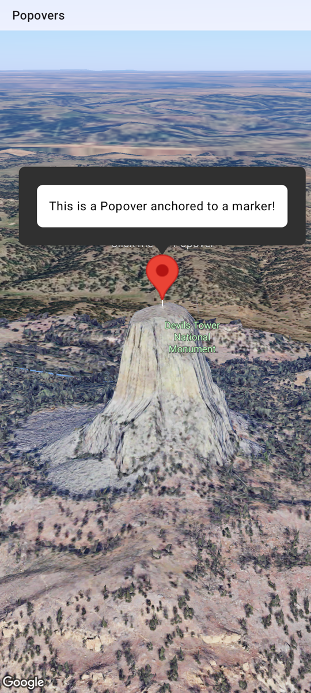
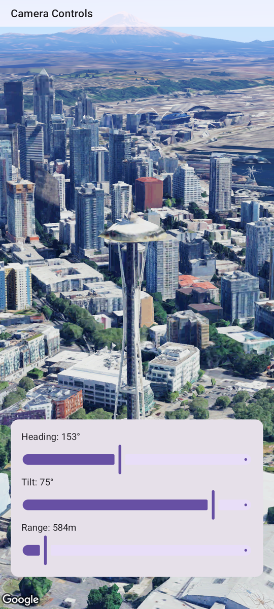
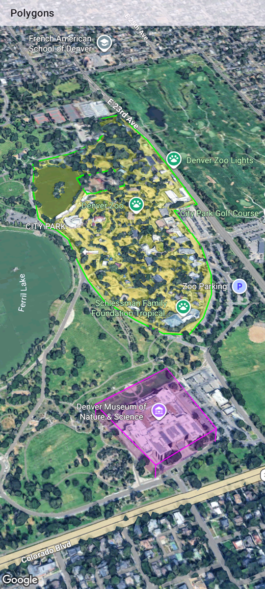
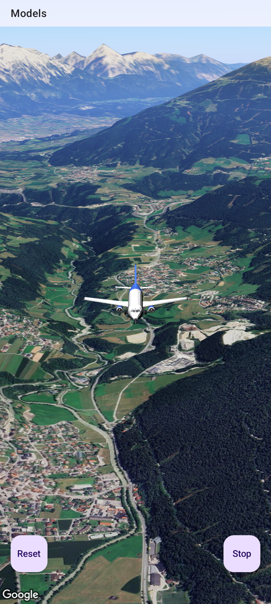
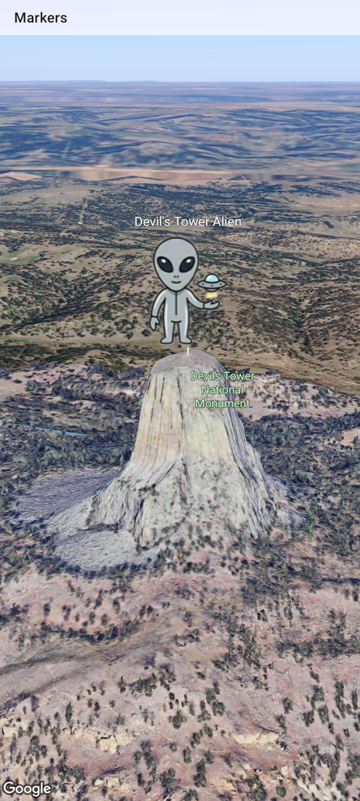
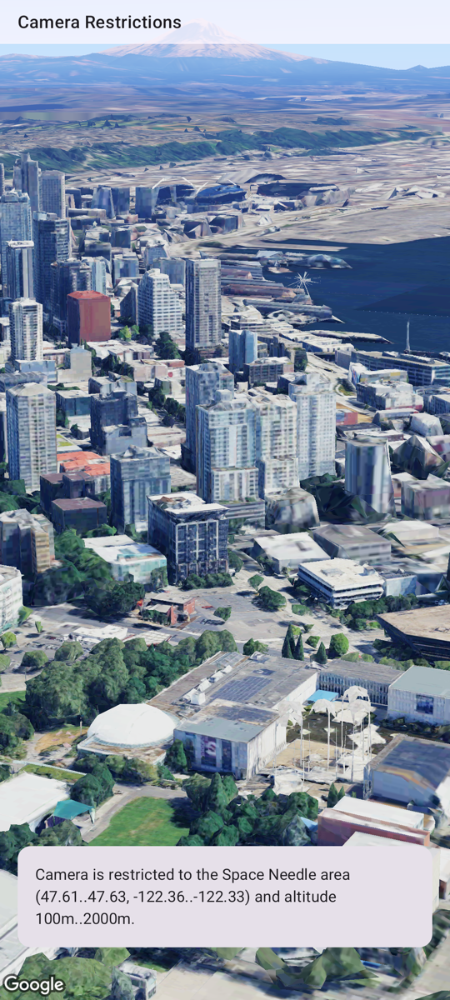
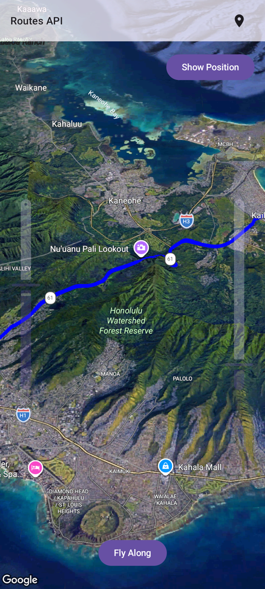
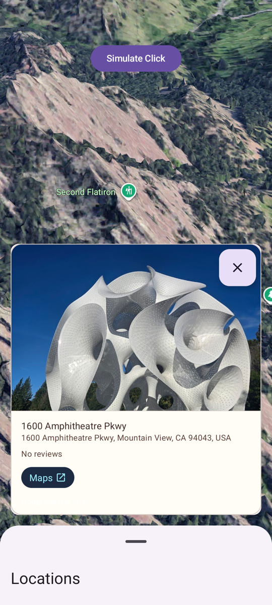

# 🚀 Jetpack Compose Samples Catalog

This directory contains the Compose samples for the Android Maps 3D SDK. We use a state-driven approach and lean on the `maps3d-compose` library.

## 📊 Sample Status

| Feature | Status | Source Code | Screenshot |
| :--- | :--- | :--- | :--- |
| **Basic Map** | ✅ Done | [HelloMapActivity.kt](src/main/java/com/example/composedemos/hellomap/HelloMapActivity.kt) |  |
| **Polylines** | ✅ Done | [PolylinesActivity.kt](src/main/java/com/example/composedemos/polylines/PolylinesActivity.kt) |  |
| **Map Interactions** | 🚧 Skeleton | [MapInteractionsActivity.kt](src/main/java/com/example/composedemos/mapinteractions/MapInteractionsActivity.kt) | |
| **Popovers** | ✅ Done | [PopoversActivity.kt](src/main/java/com/example/composedemos/popovers/PopoversActivity.kt) |  |
| **Camera Controls** | ✅ Done | [CameraControlsActivity.kt](src/main/java/com/example/composedemos/cameracontrols/CameraControlsActivity.kt) |  |
| **Polygons** | ✅ Done | [PolygonsActivity.kt](src/main/java/com/example/composedemos/polygons/PolygonsActivity.kt) |  |
| **Models** | ✅ Done | [ModelsActivity.kt](src/main/java/com/example/composedemos/models/ModelsActivity.kt) |  |
| **Markers** | ✅ Done | [MarkersActivity.kt](src/main/java/com/example/composedemos/markers/MarkersActivity.kt) |  |
| **Camera Restrictions** | ✅ Done | [CameraRestrictionsActivity.kt](src/main/java/com/example/composedemos/camerarestrictions/CameraRestrictionsActivity.kt) |  |
| **Flight Simulator** | 🚧 Skeleton | [FlightSimulatorActivity.kt](src/main/java/com/example/composedemos/flightsimulator/FlightSimulatorActivity.kt) | |
| **Routes API** | ✅ Done | [RoutesActivity.kt](src/main/java/com/example/composedemos/routes/RoutesActivity.kt) |  |
| **Path Following** | 🚧 Skeleton | [PathFollowingActivity.kt](src/main/java/com/example/composedemos/pathfollowing/PathFollowingActivity.kt) | |
| **Path Styling** | 🚧 Skeleton | [PathStylingActivity.kt](src/main/java/com/example/composedemos/pathstyling/PathStylingActivity.kt) | |
| **Animating Models** | 🚧 Skeleton | [AnimatingModelsActivity.kt](src/main/java/com/example/composedemos/animatingmodels/AnimatingModelsActivity.kt) | |
| **Place Search** | 🚧 Skeleton | [PlaceSearchActivity.kt](src/main/java/com/example/composedemos/placesearch/PlaceSearchActivity.kt) | |
| **Place Autocomplete** | 🚧 Skeleton | [PlaceAutocompleteActivity.kt](src/main/java/com/example/composedemos/placeautocomplete/PlaceAutocompleteActivity.kt) | |
| **Place Details** | ✅ Done | [PlaceDetailsActivity.kt](src/main/java/com/example/composedemos/placedetails/PlaceDetailsActivity.kt) |  |
| **Advanced Camera Animation** | 🚧 Skeleton | [AdvancedCameraAnimationActivity.kt](src/main/java/com/example/composedemos/advancedcameraanimation/AdvancedCameraAnimationActivity.kt) | |
| **Data Visualization** | 🚧 Skeleton | [DataVisualizationActivity.kt](src/main/java/com/example/composedemos/datavisualization/DataVisualizationActivity.kt) | |
| **Cloud Map Styling** | 🚧 Skeleton | [CloudStylingActivity.kt](src/main/java/com/example/composedemos/cloudstyling/CloudStylingActivity.kt) | |
| **Roadmap Mode** | 🚧 Skeleton | [RoadmapModeActivity.kt](src/main/java/com/example/composedemos/roadmapmode/RoadmapModeActivity.kt) | |
| **Field Of View** | 🚧 Skeleton | [FieldOfViewActivity.kt](src/main/java/com/example/composedemos/fieldofview/FieldOfViewActivity.kt) | |

---
> [!NOTE]
> Status `🚧 Skeleton` means the activity exists and can be launched from the main list, but contains a TODO placeholder UI. We are actively implementing these following a TDD approach.
