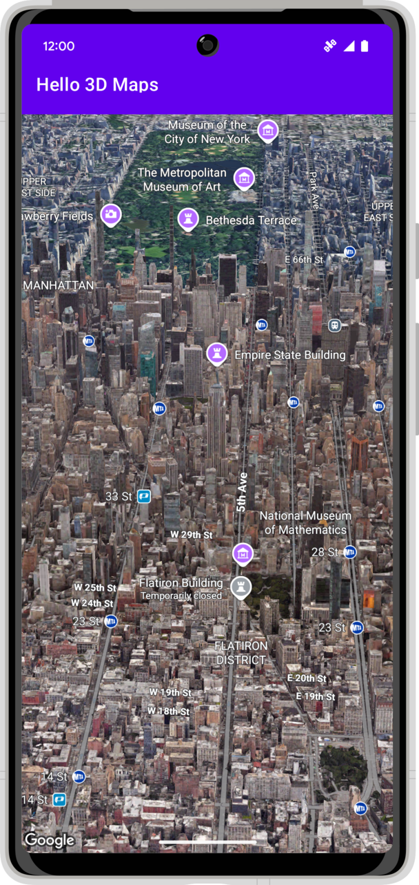
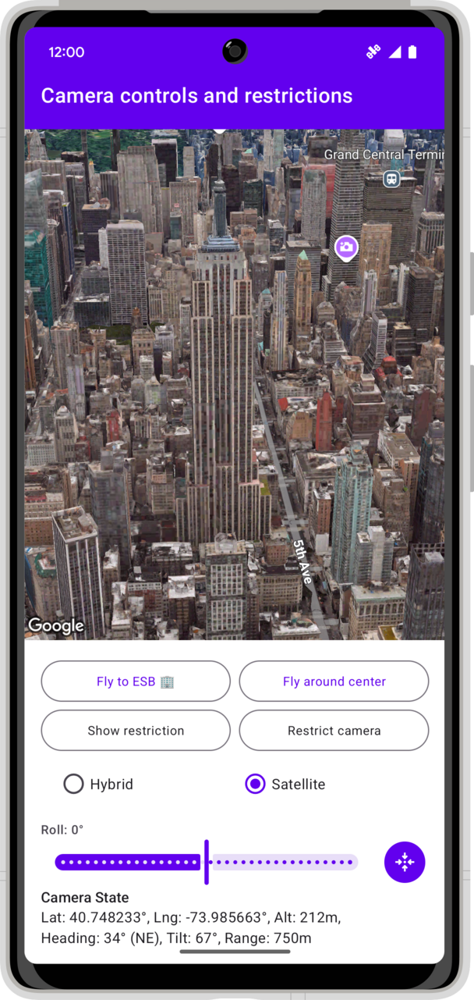
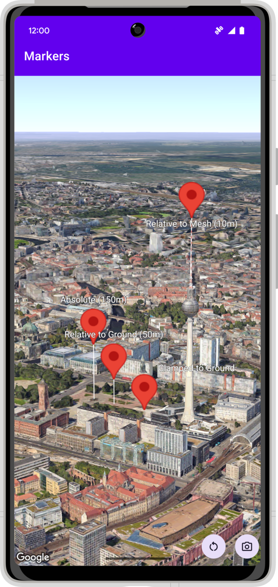
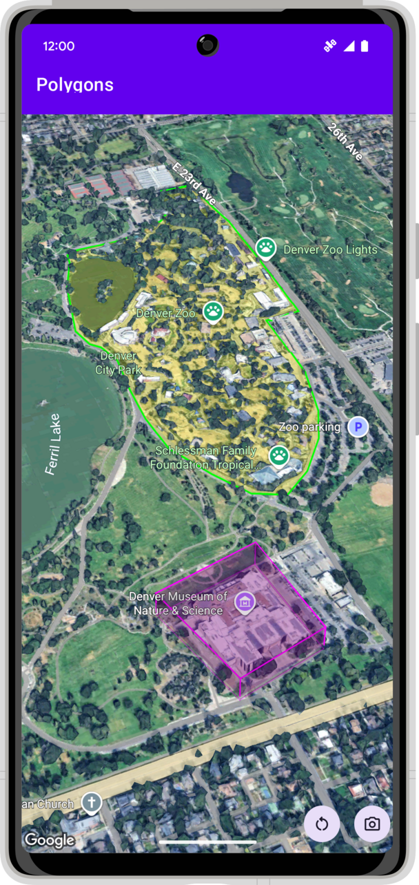
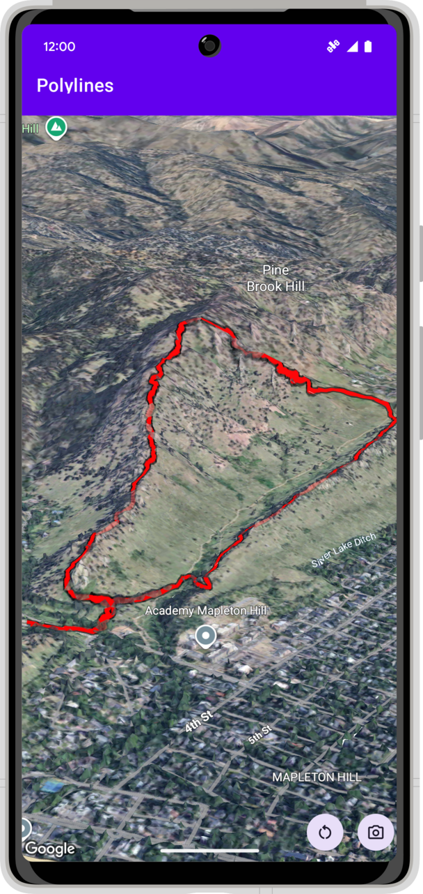
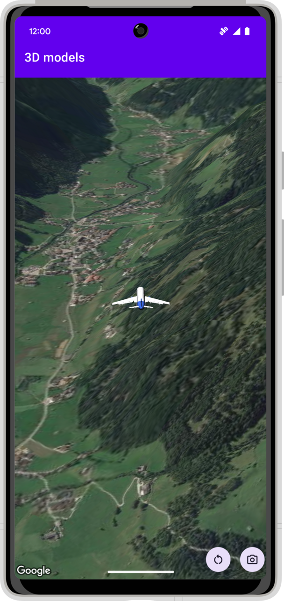

[](https://github.com/googlemaps-samples/android-maps3d-samples/actions/workflows/build.yml)


[][license]
[](https://stackoverflow.com/questions/tagged/android+google-maps)
[][Discord server]

# Google Maps 3D SDK for Android Samples


| Hello Map                                                                            | Camera                                                                                            | Markers                                   | Polygons                                  | Polylines                                 | Models                                  |
|:-------------------------------------------------------------------------------------|:--------------------------------------------------------------------------------------------------| :---------------------------------------- | :---------------------------------------- | :---------------------------------------- | :---------------------------------------- |
|  |  |  |  |  |  |

## Description

The [Google Maps Platform Maps3D SDK for Android](https://developers.google.com/maps/documentation/maps-3d/android-sdk) (Experimental Preview) 
empowers developers to bring immersive, real-world 3D experiences into their Android applications. This SDK allows you to render detailed 3D buildings, 
terrain, and landmarks, offering users a richer and more interactive way to explore geographical data. Key features include programmatic camera control 
for cinematic fly-throughs, the ability to add 3D markers and models to the map, and drawing custom polylines and polygons in a 3D space.

This repository provides a collection of sample applications to help you get started and explore the capabilities of the Maps3D SDK:

* **[Maps3DSamples/ApiDemos/kotlin-app](Maps3DSamples/ApiDemos/kotlin-app)**: This module showcases the fundamental API features using Kotlin and traditional
Android Views. It's a great starting point to understand core concepts like map instantiation, camera manipulation, and adding various map objects.
* **[Maps3DSamples/ApiDemos/kotlin-compose-app](Maps3DSamples/ApiDemos/kotlin-compose-app)**: For developers using Jetpack Compose, this sample demonstrates
how to integrate the Maps3D SDK into a declarative UI. It utilizes helper classes to bridge the SDK's View-based nature with Compose, offering a more modern
approach to building UIs with 3D maps. *(Note: Coming soon!)*
* **Demos**: The repository also includes several more complex demo applications that illustrate more advanced use cases and integrations of the Maps3D library,
providing inspiration for building sophisticated 3D mapping applications. *(Note: Coming soon!).*

## Samples in this repo

This repo contains the following samples:

**[Maps3DSamples/ApiDemos/kotlin-app](Maps3DSamples/ApiDemos/kotlin-app)**: Demonstrates various features of the **Maps3D SDK for Android**
using Kotlin and Android Views. This module includes examples for:

* Basic map setup ("Hello Map")
* Camera controls and restrictions
* Adding and customizing markers
* Drawing polygons and polylines
* Loading and displaying 3D models

The [Maps3DSamples/ApiDemos/common](Maps3DSamples/ApiDemos/common) module contains shared utilities and layouts.

## Requirements

To run the samples, you will need:

- To [sign up with Google Maps Platform] and enable **Maps3D API for Android**. 
- An [API key] associated with the project above. Follow the [API key instructions] if you're new to the process.
- Copy `Maps3DSamples/ApiDemos/local.defaults.properties` to `Maps3DSamples/ApiDemos/secrets.properties` and set the value of `MAPS3D_API_KEY` to your API key.
- All samples require up-to-date versions of the Android build tools and the Android support repository.

## Running the sample(s)

1.  Download the samples by cloning this repository:
    ```bash
    git clone https://github.com/googlemaps-samples/android-maps3d-samples.git
    ```
2.  In the welcome screen of Android Studio, select "Open".
3.  Navigate to the root directory of this cloned repository and select it, or navigate into a specific sample directory, `Maps3DSamples/ApiDemos`, and open it as a project.

Alternatively, use the `gradlew build` command within a sample's directory to build the project directly or download an APK
under [releases](https://github.com/googlemaps/android-maps3d-samples/releases) (if available for the specific sample).

## Contributing

Contributions are welcome and encouraged! If you'd like to contribute, send us a [pull request] and refer to our [code of conduct] and [contributing guide].

## Terms of Service

This sample uses Google Maps Platform services. Use of Google Maps Platform services through this sample is subject to the Google Maps Platform [Terms of Service].

This sample is not a Google Maps Platform Core Service. Therefore, the Google Maps Platform Terms of Service (e.g. Technical Support Services, Service Level Agreements, and Deprecation Policy) do not apply to the code in this sample.

## Support

This sample is offered via an open source [license]. It is not governed by the Google Maps Platform Support [Technical Support Services Guidelines], the [SLA], or the [Deprecation Policy]. However, any Google Maps Platform services used by the sample remain subject to the Google Maps Platform Terms of Service.

If you find a bug, or have a feature request, please [file an issue] on GitHub. If you would like to get answers to technical questions from other Google Maps Platform developers, ask through one of our [developer community channels]. If you'd like to contribute, please check the [contributing guide].

You can also discuss this sample on our [Discord server].

[android-sdk]: https://developers.google.com/maps/documentation/android-sdk
[API key]: https://developers.google.com/maps/documentation/android-sdk/get-api-key
[API key instructions]: https://developers.google.com/maps/documentation/android-sdk/config#step_3_add_your_api_key_to_the_project

[code of conduct]: ?tab=coc-ov-file#readme
[contributing guide]: CONTRIBUTING.md
[Deprecation Policy]: https://cloud.google.com/maps-platform/terms
[developer community channels]: https://developers.google.com/maps/developer-community
[Discord server]: https://discord.gg/hYsWbmk
[file an issue]: https://github.com/googlemaps-samples/android-maps3d-samples/issues/new/choose
[license]: LICENSE
[pull request]: https://github.com/googlemaps-samples/android-maps3d-samples/compare
[project]: https://developers.google.com/maps/documentation/android-sdk/cloud-setup#enabling-apis
[Sign up with Google Maps Platform]: https://console.cloud.google.com/google/maps-apis/start
[SLA]: https://cloud.google.com/maps-platform/terms/sla
[Technical Support Services Guidelines]: https://cloud.google.com/maps-platform/terms/tssg
[Terms of Service]: https://cloud.google.com/maps-platform/terms

